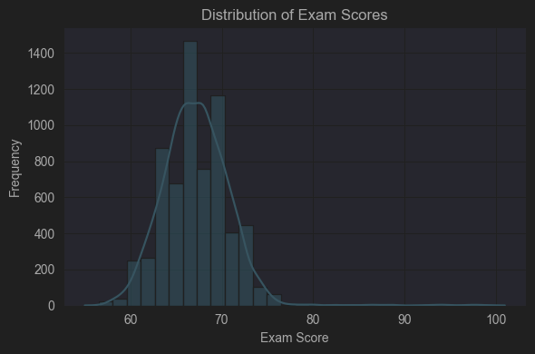
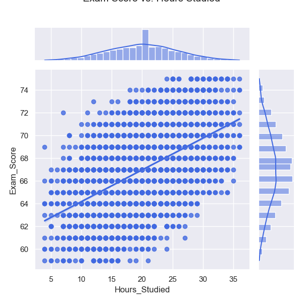
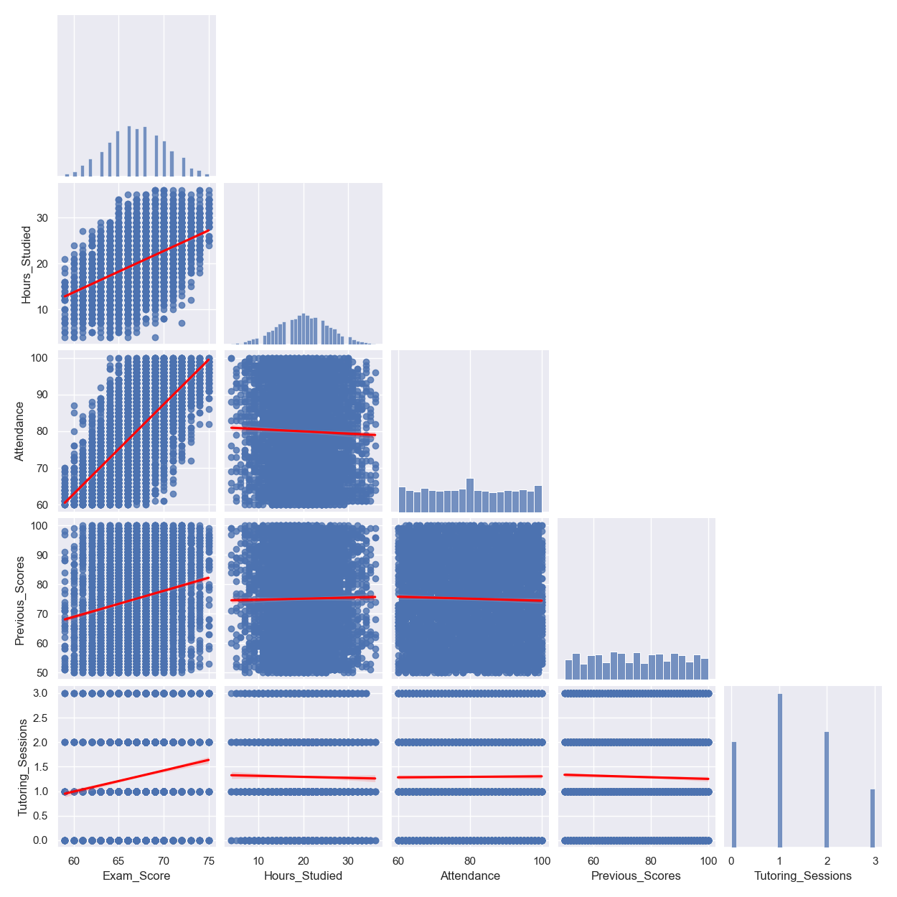
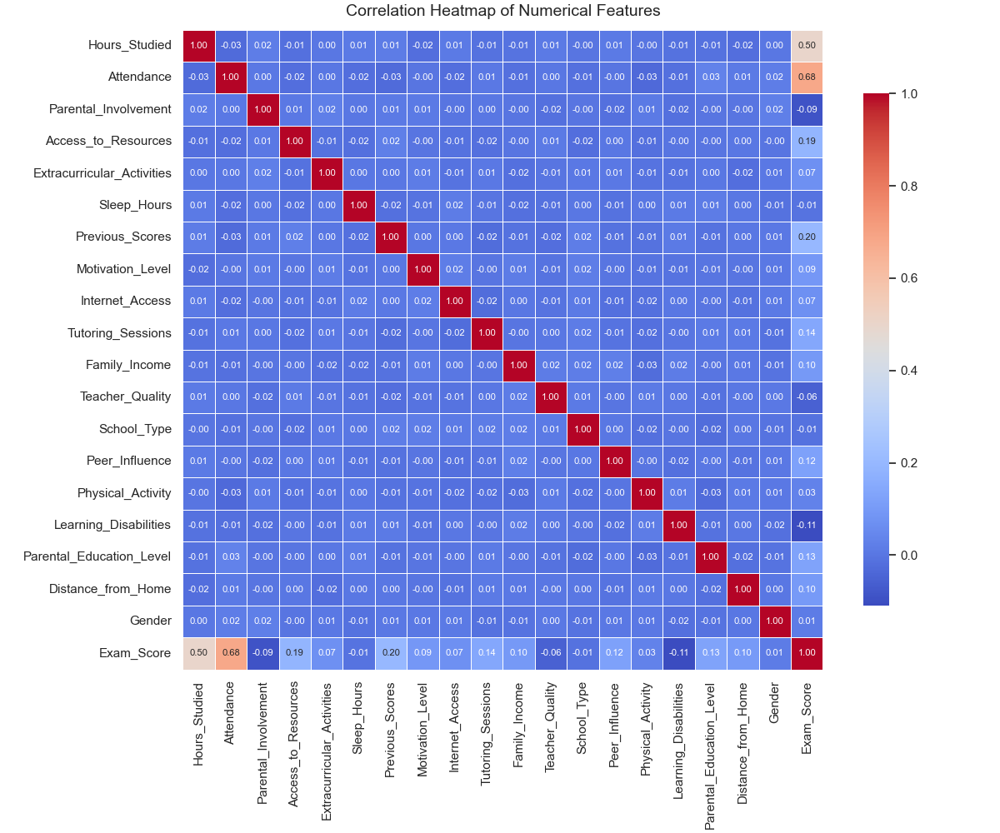
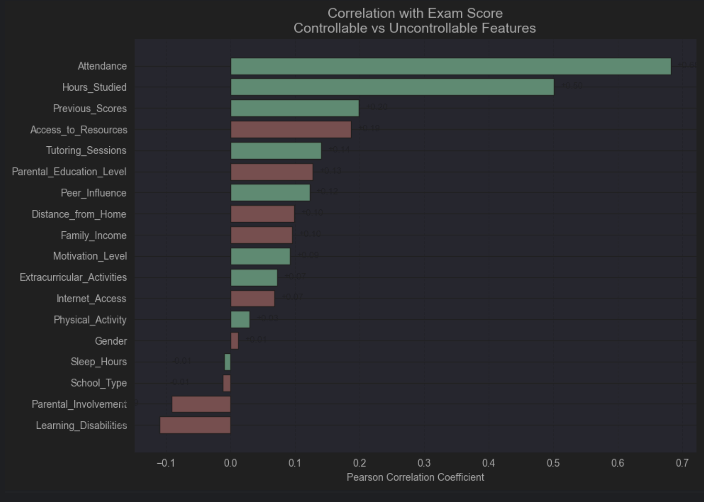
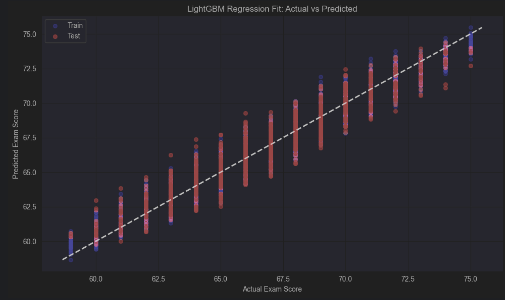
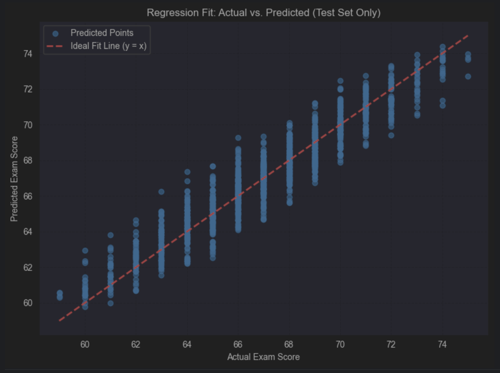
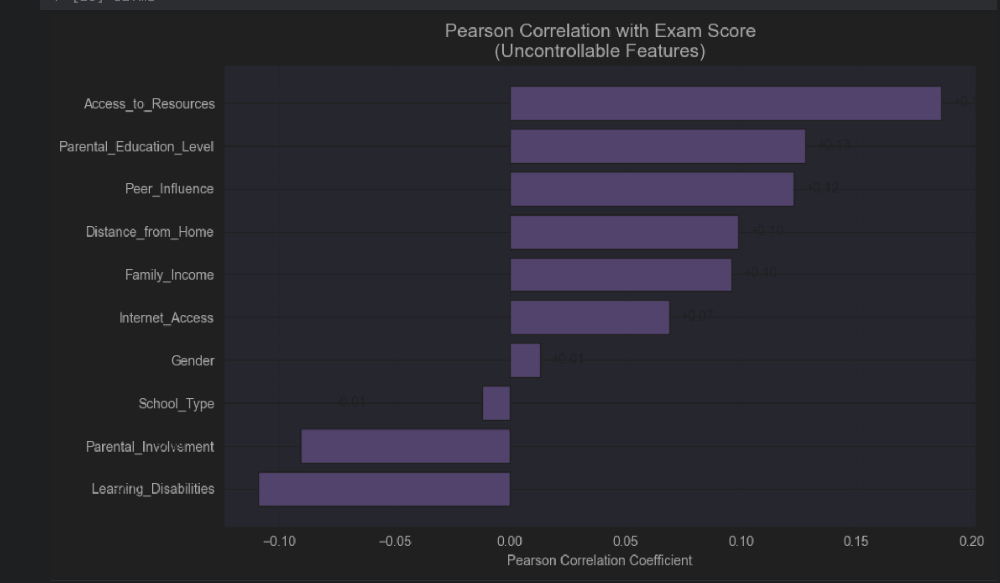

#  Student Exam Score Prediction

##  Project Overview

This project aims to identify and quantify the factors that influence a student's academic success, using a dataset of behavioral, demographic, and environmental variables, we apply both statistical analysis and machine learning techniques to:
- Understand which features matter most in general,
- See how uncontrollable factors (e.g. parental education, access to resources) affect student performance in specific.
- Build a predictive model for general prediction and another model just focused on environmental factors.
- Ultimately, help educators to take early actions for students at risk and give students an idea about what to focus on to improve their academic success.

---

##  Exploratory Data Analysis (EDA)

The initial dataset consists of 6607 student records and 19 features.  
We examined distributions, missing values, and feature interactions to identify data quality issues and early trends.

### Distribution of Exam Scores

> The exam scores are approximately normally distributed, centered around 67 with less deviation than expected.

### Jointplots for exam vs study time

> This jointplot above provides a comprehensive view of the relationship between `Hours_Studied`, which is the first factor that comes to mind to correlate with student success, and `Exam_Score`, combining:
> - a **scatterplot** (center),
> - **marginal histograms** (top and right), and
> - a **regression line** to capture linear trend.

>  **Interpretation**:
> - A clear **positive linear trend** is evident: more study hours tend to result in higher exam scores as expected
> - The **distribution of scores** is tighter for mid-to-high study hours (15–30), suggesting higher consistency.
> - The density of points at 65–70 indicates that most students cluster around that score regardless of studying effort, but the **upper bound increases** with more hours.
> - There is a limit, students who study more and more do not see dramatic improvements.

### Pairplot for feature interactions

> This pairplot explores bivariate relationships between `Exam_Score`, `Hours_Studied`, `Attendance`, `Previous_Scores`, and `Tutoring_Sessions`.

> 🔍 **Key Observations**:
> - `Exam_Score` has the strongest visible correlation with `Attendance` and `Hours_Studied`.
> - `Previous_Scores` and `Tutoring_Sessions` show **weaker but still positive** relationships.
> - `Attendance` and `Hours_Studied` show a slight positive association with each other.

### Correlation Heatmap

> The heatmap confirms shows all features correlation with each other.

### Correlation Bar Chart- Controllable vs Uncontrollable Features
---
> The bar chart visualizes the correlation of controllable features (like study habits) versus uncontrollable features (like family background).
> Red bars indicate uncontrollable features, while blue bars indicate controllable features.
> Interestingly, parental involvement comes out to very interesting with the negative correlation it has.

---
##  Predictive Modeling

###  Full Feature Model (All Predictors)

We trained a LightGBM model using all available features, including behavioral variables such as attendance and hours studied.

- **RMSE**: 1.03  
- **R² Score**: **0.89**

This model achieves very high predictive performance by incorporating both environmental and behavioral data.

####  Prediction vs. Actual Plot

> The model's predictions align closely with the real data, indicating strong fit.
---
# Interpretation of Features 
This analysis presents Ridge Regression results using a dataset where outliers in numerical features have been removed.  
All features were standardized prior to training to ensure the comparability of coefficient magnitudes.

---

### 🔝 Top Influential Features

#### 1. **Attendance** (+2.29)
> Attendance is the most influential factor in predicting exam performance. As attendance increases, scores improve significantly.

#### 2. **Hours_Studied** (+1.71)
> Study time has a strong positive effect. Students who invest more time in studying tend to perform better.

#### 3. **Previous_Scores** (+0.69)
> Previous academic performance remains a meaningful predictor, indicating some consistency in student outcomes.

#### 4. **Access_to_Resources** (+0.68)
> Better access to academic resources (books, internet, tools) is associated with higher scores.

#### 5. **Tutoring_Sessions** (+0.50)
> Receiving tutoring support contributes positively, though the effect is smaller than that of core behavioral factors.

---

### 🟡 Moderate Contributors

#### 6. **Peer_Influence** (+0.39)
> Positive peer influence correlates with improved performance, supporting the role of social environment.

#### 7. **Parental_Education_Level** (+0.38)
> Students with more educated parents show moderately higher scores.

#### 8. **Family_Income** (+0.37)
> Income level has a moderate impact, possibly reflecting access to better environments or opportunities.

#### 9. **Parental_Involvement** (−0.36)
> The negative coefficient may reflect reactive involvement, where parents become more engaged when students are already struggling.

#### 10. **Motivation_Level** (+0.34)
> Motivation shows a moderate positive effect, though slightly weaker than resource-related and behavioral features.

---

### 🟢 Minor Effects

#### 11. **Distance_from_Home** (+0.33)
> Students living closer to school tend to perform slightly better, potentially due to less commute fatigue.

#### 12. **Learning_Disabilities** (−0.31)
> Learning disabilities are associated with a moderate reduction in scores.

#### 13. **Internet_Access** (+0.28)
> Internet access shows a small but consistent positive contribution to academic performance.

#### 14. **Extracurricular_Activities** (+0.25)
> Participation in extracurricular activities has a minor positive effect.

#### 15. **Physical_Activity** (+0.24)
> Physical activity contributes positively in a small but noticeable way.

---

### ⚪ Features with Negligible or No Impact

#### 16. **Teacher_Quality** (−0.19)
> Teacher quality shows a weak negative coefficient in this model.

#### 17. **Sleep_Hours** (+0.02)
> Sleep duration has a minimal positive association with exam score.

#### 18. **School_Type** (−0.01)
> No notable difference observed between public and private school types.

#### 19. **Gender** (−0.01)
> Gender has no significant effect on exam score in this dataset.

---
###  Environmental-Only Model (Uncontrollable Features)

We also trained a LightGBM model using **only uncontrollable features**, such as family income, parental education, and learning disabilities.

- **RMSE**: 1.03  
- **R² Score**: **0.8900**

This result highlights that even without student behavior (like study time or attendance), environmental background alone can explain almost 89% of the variance in academic performance.

####  Prediction vs. Actual Plot

> The uncontrollable-only model also achieves a high level of predictive power. The points remain tightly aligned with the ideal diagonal, suggesting that background conditions are highly informative.

### Feature analysis for Uncontrollable Features

> Environmental variables like access to resources and parental education show measurable correlation with student performance. Learning disabilities and high parental involvement are negatively associated, while gender and school type show no meaningful link.

#  Interpretation of Features (Uncontrollable Features)

Below is a detailed explanation of how each uncontrollable feature correlates with students' exam performance.

---

###  Access_to_Resources (+0.187)
> Students with better access to learning resources tend to perform better academically. This feature has the **strongest positive correlation**, highlighting the importance of infrastructure and environment.

###  Parental_Education_Level (+0.128)
> Students whose parents have higher education levels typically achieve slightly better scores. This may be due to long-term academic modeling and home support culture.

###  Peer_Influence (+0.123)
> A positive social environment contributes to better outcomes. Students surrounded by academically driven peers are more likely to stay motivated and engaged.

###  Distance_from_Home (+0.099)
> Students living closer to school perform slightly better, possibly due to reduced fatigue, time efficiency, or better attendance consistency.

###  Family_Income (+0.096)
> Higher income levels show a modest association with exam scores, likely reflecting access to educational tools, tutoring, and stable study environments.

###  Internet_Access (+0.069)
> Students with internet access tend to perform better, though the effect is small. Access to digital learning platforms and information may provide slight advantages.

###  Gender (+0.013)
> Gender shows **no meaningful correlation** with academic performance in this dataset, indicating similar outcomes across male and female students.

###  School_Type (−0.012)
> Whether the school is public or private has a **negligible and slightly negative** correlation with performance, suggesting that structural school differences are not decisive.

###  Parental_Involvement (−0.091)
> Surprisingly, increased parental involvement shows a negative correlation. This may reflect **reactive behavior**, where parents increase involvement when students begin to struggle.

###  Learning_Disabilities (−0.109)
> Students with learning disabilities tend to score lower on average, which reflects known academic challenges and the need for more personalized support.

---

 **Summary**:
- The most influential uncontrollable factor is `Access_to_Resources`, followed by parental education and peer influence.
- Environmental and demographic conditions show measurable but generally moderate impacts.
- Gender and school type appear to play no significant role, while learning disabilities represent a critical risk factor needing targeted intervention.

---

---

###  Conclusion

Predictive models reinforces the importance of **attendance**, **study time**, and **resource access** in student performance.
It is visible that environmental factors only are providing a strong prediction with 0.89 R2 metric.

These results provide a clear framework for prioritizing interventions aimed at improving academic outcomes.

###  Data-Driven Recommendations for Educators

Based on the predictive model and feature effect analysis, the following recommendations are proposed to help teachers proactively identify and support students at risk of academic struggle:

- **Track and prioritize attendance**:  
  Since attendance is the most powerful predictor of performance, even slight drops in attendance may signal the need for intervention.

- **Monitor study time or homework submission frequency**:  
  Hours studied significantly influence scores. Students who appear disengaged outside of class may benefit from personalized study plans or after-school programs.

- **Use previous academic performance as a benchmark, not a verdict**:  
  While past scores are useful, they do not fully determine current outcomes. Students with low prior performance but strong study habits may be on a recovery path.

- **Help to improve access to learning resources**:  
  Students with limited access to books, digital tools, or stable environments should be provided with institutional support to level the playing field.

- **Be aware of peer influence patterns**:  
  Students who are part of academically disengaged peer groups may require additional encouragement or positive peer modeling.

- **Watch for students with learning difficulties — even if they have average scores**:  
  The model shows that learning disabilities are associated with a measurable drop in performance. Early detection and accommodations are essential.

- **Raise awareness on parental involvement**:  
  Parental involvement shows a negative correlation, indicating that some parents may be stressing out students even more.

##  For Students 
- **Show up — consistently**:
Attending classes is not only important for the content, but also for maintaining a student mindset. *And remember, they might sound similar, but attendance and attention are not the same.*
- **Study smart, not endlessly**:
Instead of just increasing hours, focus on quality: active recall, focused blocks, and regular review matter most.
- **Don’t be defined by your past scores**:
Your improvement trajectory is what counts. Use feedback to adjust, not to label yourself.
- **Ask for help early**:
Especially if you are lacking resources, share it with people who can help you.
- **Choose your study environment and friends wisely**:
Spend time around people who encourage your goals. Peer effect matters more than you think.

- **Talk to your parents about what helps and what doesn’t**:
Be open about pressure, expectations, and how they can support you without pressuring you more.

##  Technologies Used

- Python, pandas, scikit-learn, lightgbm, matplotlib, seaborn
- Jupyter Notebooks
- Ridge Regression, LightGBM, ANOVA, correlation analysis